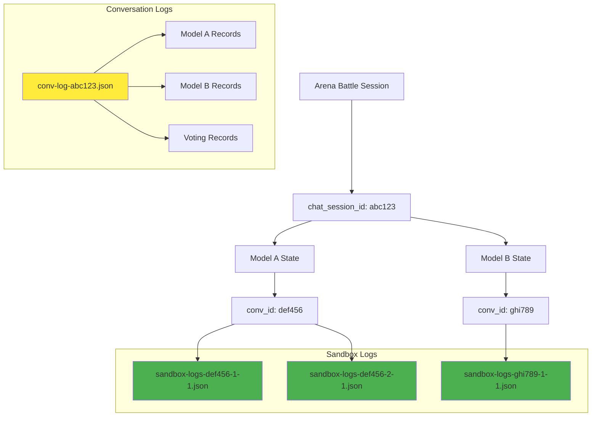

# SWE Arena Logging Systems

## Core IDs Design

In FastChat Arena's battle mode, there are three key identifiers:

- **`chat_session_id`**: Session-level unique identifier, shared by both models in the same battle
- **`conv_id`**: Conversation-level unique identifier, unique to each model instance
- **`sandbox_id`**: Remote e2b sandbox environment identifier, unique to each sandbox instance where code executes

| Aspect | Conversation Logs | Sandbox Logs |
|--------|-------------------|--------------|
| **Filename Based On** | `chat_session_id` | `conv_id` |
| **File Granularity** | Per Session (cross-model) | Per Model Per Round |
| **Write Mode** | Append mode | Overwrite mode |
| **Content Scope** | Complete battle records | Single sandbox operation |

## Architecture Diagram



## File Naming Rules

### Conversation Logs
```
logs/{date}/conv_logs/{chat_mode}/conv-log-{chat_session_id}.json
```
**Example**: `logs/2025_01_15/conv_logs/battle_anony/conv-log-abc123.json`

The same `conv_logs` file will contain the outputs of both models in a battle session.

### Sandbox Logs

- **Purpose**: Record precise code execution states
- **Characteristics**: Each model's each sandbox operation has an independent file
- **Use Cases**: Code debugging, execution state tracking, version control

```
logs/{date}/sandbox_logs/sandbox-logs-{conv_id}-{chat_round}-{sandbox_run_round}.json
```
**Example**: `logs/2025_01_15/sandbox_logs/sandbox-logs-def456-1-1.json`
- Meaning: on 2025_01_15, the conv id `def456`, the first response, the first time to run.
- If users send another followup prompt, it will be `logs/2025_01_15/sandbox_logs/sandbox-logs-def456-2-1.json`.
- If users run the sandbox again to re-initialize, it will be `logs/2025_01_15/sandbox_logs/sandbox-logs-def456-2-2.json`.

## Log Content Format

### Conversation Logs Content
Conversation logs use **JSONL (JSON Lines)** format where each line represents a separate record. Each record contains the complete conversation history up to that point, making the logs self-contained and allowing full context reconstruction.

**Example content structure**:
```jsonl
{"tstamp": 1234567890, "type": "chat", "model": "gpt-4", "state": {"conv_id": "def456", "chat_session_id": "abc123", "messages": [["user", "Hello"], ["assistant", "Hi there!"]]}}
{"tstamp": 1234567891, "type": "chat", "model": "claude-3", "state": {"conv_id": "ghi789", "chat_session_id": "abc123", "messages": [["user", "Hello"], ["assistant", "Hello! How can I help?"]]}}
{"tstamp": 1234567892, "type": "leftvote", "model": "gpt-4", "state": {"conv_id": "def456", "chat_session_id": "abc123", "messages": [["user", "Hello"], ["assistant", "Hi there!"], ["user", "Write code"], ["assistant", "Here's some code..."]]}}
```

Key characteristics:
- **JSONL format**: One JSON object per line
- **Incremental records**: Each line is a separate event (chat, vote, etc.)
- **Full conversation history**: The `messages` field contains the entire conversation history up to that record
- **Cross-model tracking**: Records from both models in the same battle session

### Sandbox Logs Content
Sandbox logs use **JSON format** (not JSONL) with a single comprehensive object per file containing the sandbox state and user interactions.

**Example content structure**:
```json
{
  "sandbox_state": {
    "conv_id": "def456",
    "chat_session_id": "abc123", 
    "enabled_round": 1,
    "sandbox_run_round": 1,
    "sandbox_id": "e2b_abc123",
    "code_to_execute": "print('hello world')",
    "sandbox_output": "hello world\n",
    "sandbox_error": ""
  },
  "user_interaction_records": [...]
}
```

## Relationship Mapping

Both log types are fully correlated through ID fields:

```python
# Find all records for a session
conv_file = f"conv-log-{chat_session_id}.json"

# Find sandbox records for a specific model
sandbox_files = glob(f"sandbox-logs-{conv_id}-*-*.json")
```
